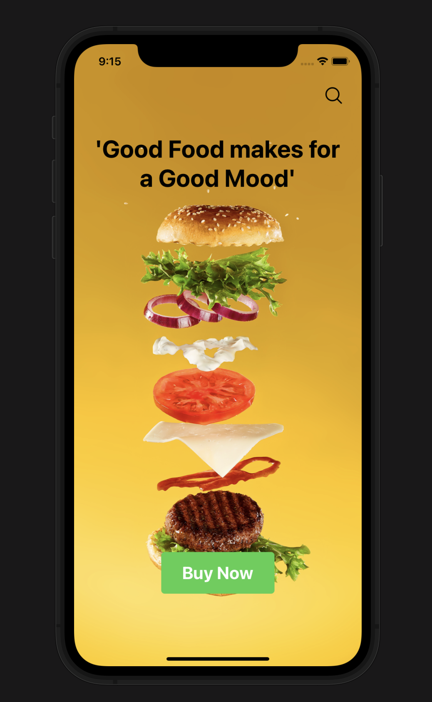
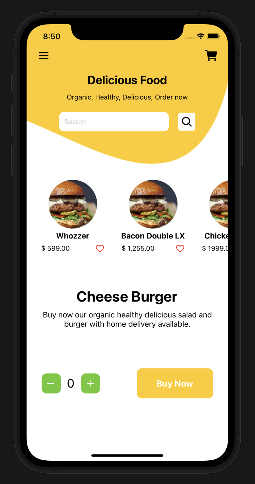

<div align="center" id="top"> 
  

&#xa0;

  <!-- <a href="https://burgerzilla.netlify.app">Demo</a> -->
</div>

<h1 align="center">Burgerzilla</h1>

<p align="center">
  

  

  

  
</p>

<!-- Status -->

<!-- <h4 align="center">
	🚧  Burgerzilla 🚀 Under construction...  🚧
</h4>

<hr> -->

<p align="center">
  <a href="#dart-about">About</a> &#xa0; | &#xa0; 
  <a href="#sparkles-features">Features</a> &#xa0; | &#xa0;
  <a href="#rocket-technologies">Technologies</a> &#xa0; | &#xa0;
  <a href="#white_check_mark-requirements">Requirements</a> &#xa0; | &#xa0;
  <a href="#checkered_flag-starting">Starting</a> &#xa0; | &#xa0;
  <a href="#memo-license">License</a> &#xa0; | &#xa0;
  <a href="https://github.com/gregorywoolery" target="_blank">Author</a>
</p>

<br>

## :dart: About

Hi, Burgerzilla was a pet 🐈 project that would allow user's to view the menu from a restaurant, select from the options and make their order. It was build in React Native Expo.

Please enjoy using the project template for your reactive needs 🥳

## :sparkles: Features

:heavy_check_mark: Amazing Splash screen;\
:heavy_check_mark: Scroll through menu horizontaly\
:heavy_check_mark: Update order number;

## :rocket: Technologies

The following tools were used in this project:

- [Expo](https://expo.io/)
- [Node.js](https://nodejs.org/en/)
- [React](https://pt-br.reactjs.org/)
- [React Native](https://reactnative.dev/)
- [TypeScript](https://www.typescriptlang.org/)
- [Expo](https://docs.expo.dev/)

## :white_check_mark: Requirements

Before starting :checkered_flag:, you need to have [Git](https://git-scm.com) and [Node](https://nodejs.org/en/) installed.

## :checkered_flag: Starting

```bash
# Clone this project
$ git clone https://github.com/gregorywoolery/burgerzilla.git

# Access
$ cd burgerzilla

# Install dependencies
$ npm install

# Run the project
# IOS
$ npm run ios

# Android
$ npm run android

# Expo Client
$ npm run start

```





## :memo: License

This project is under license from MIT. For more details, see the [LICENSE](LICENSE.md) file.

Made with :heart: by <a href="https://github.com/gregorywoolery" target="_blank">Gregory Woolery</a>

&#xa0;

<a href="#top">Back to top</a>
